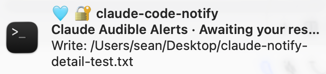
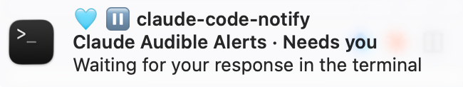
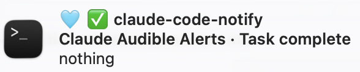

# claude-code-notify

Rich macOS notifications for [Claude Code](https://claude.com/claude-code). Tells you *which* session wants you, *what* it wants, and takes you straight there when you click.

Out of the box Claude Code makes no sound and posts nothing when a turn finishes or a permission prompt appears. If you run several sessions across terminal tabs, you either sit and watch or you come back late.

**A tool is waiting on approval** — the body names the exact call and its target:



**Claude is asking you a question** — no tool to name, so the wording stays neutral rather than guessing:



**The turn finished** — the body summarises what Claude last said:



- **Colour square** — the session's `/color`, so parallel sessions are distinguishable at a glance
- **Icon** — ⏸️ needs a response, ⏳ waiting, ✅ complete
- **Title** — the project directory
- **Subtitle** — the session's `/rename` name, plus what kind of attention it wants
- **Body** — what is actually being asked (`Write: /path/to/file`), or a summary of what just finished
- **Click** — focuses the exact terminal tab that session is running in

## Requirements

- macOS (uses Notification Center)
- `jq` — payload parsing. Preinstalled on recent macOS; otherwise `brew install jq`
- `python3` — detaches the click listener. Ships with Xcode Command Line Tools
- [`alerter`](https://github.com/vjeantet/alerter) — installed for you, see below
- Click-to-tab needs [Ghostty](https://ghostty.org). Other terminals get app-level activation

## Install

```sh
git clone https://github.com/cofoid/claude-code-notify.git
cd claude-code-notify
./install.sh
```

Then paste the printed snippet into `~/.claude/settings.json` and restart Claude Code.

The installer verifies `alerter`'s notarized signature with `spctl` before installing it, and refuses if verification fails. It won't edit `settings.json` for you — that file usually holds hand-tuned permissions, and an automated merge is a bad trade against printing six lines.

### First-run permissions

macOS will prompt twice. Approve both:

1. **alerter wants to send notifications** — on the first alert
2. **osascript wants to control Ghostty** — on the first click

Then make banners stick around: **System Settings → Notifications → alerter → Alert style → Alerts**. Otherwise they auto-hide in a few seconds, which defeats the point if you stepped away.

## Devcontainers

A session running inside a devcontainer has no Notification Center and no route
to the host's, so it posts nothing. What it does have is a bind-mounted
`~/.claude` — a real host directory — and that mount is the delivery channel.
No network, no SSH, nothing installed into the image.

`notify.sh` runs in the container and does all the work of deciding what the
notification should say, because the transcript and session files it reads are
container paths that mean nothing on the host. Instead of delivering, it
appends the finished notification to `~/.claude/notify-spool.jsonl` as one
line. On the host, a launchd agent drains that file and posts each line through
the same `alert.sh` a host session uses.

Give the installer the **host** path of the directory the container mounts as
`~/.claude`:

```sh
./install.sh --container ~/.ncd-devcontainer/claude
./install.sh --watch     ~/.ncd-devcontainer/claude ~/other-fork/claude
```

`--container` prints a `hooks` block to paste into that directory's
`settings.json` — which is the container's `~/.claude/settings.json`, so
`$HOME` resolves inside the container. `--watch` takes every container
directory at once; one agent drains them all. Several devcontainers sharing one
credential directory (a PHI and a web profile, say) need it named only once.

The container needs `jq` and `python3`. Both ship in the standard
`mcr.microsoft.com/devcontainers` images; if `jq` is missing the notification
still posts but arrives empty, and `notify.sh` says so on stderr rather than
exiting quietly.

Click-to-tab works for container sessions too, as long as Claude is running in
a terminal tab rather than an editor pane: Claude Code's title escape sequence
crosses the container boundary unchanged, so the host tab is titled with the
container session's name and the title match finds it. The working-directory
fallback can't help here — the payload's `cwd` is a `/workspaces/...` path no
host tab will ever match — but it fails closed, falling back to activating the
app rather than focusing an arbitrary tab.

## SSH sessions

A remote host has no shared filesystem, so the container's spool trick doesn't
apply. What it does have is the connection itself: `ssh` forwards a unix socket
into the remote, `notify.sh` writes the same finished notification into it, and
the watcher on your Mac is listening on the other end. Same payload, same
delivery — only the transport differs.

```sh
./install.sh --watch                 # listener on this Mac (once)
./install.sh --remote myserver       # hook files + 0700 socket dir on the remote
```

`--remote` prints the exact `~/.ssh/config` block to add, with absolute paths
filled in — `RemoteForward` doesn't expand `~`:

```
Host myserver
    RemoteForward /home/you/.claude/notify.d/sock /Users/you/.claude/notify.d/sock
    StreamLocalBindUnlink yes
```

`StreamLocalBindUnlink` stops a socket orphaned by a dropped connection from
blocking the next one. It's honoured by whichever end creates the socket, so if
forwarding fails with "remote port forwarding failed", the remote's
`sshd_config` needs it too.

Both ends keep the socket in a `0700` directory, created by the installer. That
is the permission that matters: `ssh(1)` warns socket file modes aren't honoured
on every OS, and the socket is created by the remote `sshd`, so the client can't
guarantee its mode.

If the tunnel is down, the notification is appended to the remote's spool and a
line goes to stderr rather than vanishing.

Click-to-tab focuses the Ghostty tab holding the SSH session, via the session
name in the title. The working-directory fallback can't work here — the remote
`cwd` matches no local tab — so `/rename` is worth using.

Re-running `--watch` rewrites the launchd agent, so pass your container
directories again if you have any; otherwise the new agent only listens for SSH.

## Configuration

Everything lives in `~/.claude/hooks/notify.conf`, created on install from [`notify.conf.example`](notify.conf.example). Edits take effect on the next notification — no restart, since `settings.json` only holds the path and the script is re-read each time.

```sh
SOUND_STOP="Hero"           # turn complete
SOUND_NOTIFICATION="Funk"   # needs your attention
TERM_APP="Ghostty"          # what a click focuses
GROUP_MODE="unique"         # or "session" — see below
DESCRIBE_REQUEST="1"        # name the pending tool in the body
IGNORE_DND="1"              # bypass Focus modes
COLOR_CYAN="🩵"             # per-colour glyphs
ICON_STOP="✅"              # per-event icons
LABEL_STOP="Done"           # per-event labels
```

Sounds are any basename from `/System/Library/Sounds` or `~/Library/Sounds` (`ls` it to browse); set to `""` for silent.

**`GROUP_MODE`** is worth a thought. `unique` (the default) gives every alert its own banner, so nothing is silently replaced — at the cost of a pile-up if you're away. `session` shows one banner per session instead, which is tidier, but when the earlier banner is still on screen the replacement updates it *in place with no sound*, and you can miss a notification entirely.

**Keep labels short.** The subtitle renders as `<session name> · <label>` and macOS truncates it around 40 characters.

Re-running `install.sh` never overwrites an existing config, so updates won't discard your choices. Environment variables (`CLAUDE_NOTIFY_TERM_APP`, `CLAUDE_NOTIFY_TIMEOUT`, `CLAUDE_NOTIFY_GROUP_MODE`, `CLAUDE_NOTIFY_BODY_LENGTH`, `CLAUDE_NOTIFY_IGNORE_DND`, `CLAUDE_NOTIFY_DESCRIBE_REQUEST`, `CLAUDE_NOTIFY_ALERTER`, `CLAUDE_NOTIFY_CONF`) override the file for one-off cases.

## How it works

Claude Code pipes a JSON payload to hooks on stdin. The useful fields differ per event:

| Field | `Stop` | `Notification` |
|---|---|---|
| `message` | always `null` | generic string, never names the tool |
| `notification_type` | — | `permission_prompt`, etc. — the real classifier |
| `last_assistant_message` | tail of Claude's reply | `null` |
| `cwd`, `session_id`, `transcript_path` | ✅ | ✅ |

**What is actually being asked** comes from the transcript, not the payload: the newest `tool_use` whose `tool_result` is still missing. The result check is what makes it safe — a completed call is not what you're being asked about, so naming it would be confidently wrong. Question boxes reach the transcript too late, so those fall back to neutral wording rather than guessing.

Two things you'd expect in the payload aren't there:

- **Session name** (`/rename`) lives in `~/.claude/sessions/<pid>.json` as `.name`, keyed by `sessionId`. Files are per-pid, so match on `sessionId` rather than guessing a filename.
- **Session colour** (`/color`) lives in the transcript as `{"type":"agent-color","agentColor":"..."}` entries, re-emitted each turn — the last wins. Read a bounded tail; transcripts reach tens of MB.

Click-to-tab uses Ghostty's AppleScript dictionary (`focus <terminal>`), matching the surface whose title contains the session name — Claude Code writes it into the terminal title. Falls back to working directory, but only on a unique match, since several tabs commonly share a repo.

## Known limitations

**Input alerts lag 1.5–6 seconds.** `Stop` is instant. `Notification` is late and variable, and it's the harness, not this script — proven by firing a local terminal bell and a Notification Center banner from the same hook and watching both arrive late together. Two delivery paths sharing no downstream machinery means the delay is upstream. Nothing here can fix it.

**No banner colour.** macOS exposes no banner-tint API. The colour square is the closest proxy.

**Clicking activates the app, then the tab.** No terminal offers direct per-tab activation; the AppleScript hop is what gets you the rest of the way, and only Ghostty ships a dictionary that allows it.

**Truncation is character-safe but not grapheme-safe.** A 140-character clip can split an emoji ZWJ sequence. Cosmetic, rare.

## Building on this

If you're extending this or writing your own Claude Code notification hook, [dead-ends-and-other-learnings.md](dead-ends-and-other-learnings.md) documents the approaches that don't work on current macOS and why — including several that fail *silently*, exiting 0 while delivering nothing.

## Uninstall

```sh
./install.sh --uninstall
```

This also unloads the watcher agent and removes the SSH socket. Container and
remote installs are left alone — delete `hooks/` and `notify-spool.jsonl*` from
the credential directory (or the remote's `~/.claude`) yourself, and remove the
`hooks` block from its `settings.json`. Drop any `RemoteForward` lines from
`~/.ssh/config` too.

Then remove the `Stop` and `Notification` entries from `~/.claude/settings.json`.

## Licence

MIT — see [LICENSE](LICENSE).
